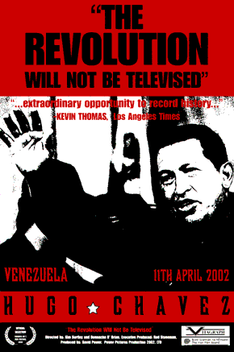

O ano é 2013. Morando sozinha pela primeira vez, vinha de uma família acostumada a se informar por mídias sensacionalistas clichês básicas, como Cidade Alerta. O medo era diário.

Não pode sair a noite  —  o índice de assaltos só cresce. Não pode sair sozinha  —  na última semana dezenas de meninas foram estupradas na região. Não pode andar de táxi  —  era comum moças serem abusadas. Não pode beber  —  semana passada uma mulher foi morta ao sair da balada.

Decidi fazer algo drástico: Retirar completamente a TV da vida. Funcionou bem. Saber desses momentos trágicos acontecendo por todo o país mudou a forma como eu enxergava a segurança pública e a minha própria segurança.

---

Passei a me informar por portais, atualizados instantaneamente, como G1, Estadão, UOL e afins. A misantropia me atingia sempre que chegava a sessão de comentários — o que me colocava frente à realidade sangrenta da maioria da população. Bloqueei todos os comentários possíveis através de extensões pelo navegador.

Com o tempo, me sentia usada pela mídia. As informações tendenciosas me faziam precisar ler a mesma notícia em dois ou três portais diferentes, para então entender e comentar sobre qualquer assunto básico. Comecei a ler portais mais influentes e com um jornalismo mais responsável, como BBC. Não foi suficiente.

Decidi tomar outra medida drástica: parei de ler diariamente todo e qualquer portal de notícias. Minha única fonte de informação passou a ser a timeline do Facebook. Insuficiente. Passei a usar mais o Twitter. Informação sob demanda, o que me permitiu ter ciência sobre o que acontecia no cidade ou no país — porém de forma não muito eficiente. Informação ininterrupta pode estragar a experiência.

---

Em resumo, nesses dois anos de experimentos, não senti falta de notícias diárias. Consegui deixar pra trás um início de Síndrome de Pânico, e a tendência absurda de achar que a realidade de qualquer cidade poderia ser aplicado à minha sem qualquer correlação.

Mas a gente, que vive na internet, que precisa de um fluxo enorme de informações, vira e mexe temos crises de abstinência. Eu preciso de muitos dados, muitas reportagens e muitos lados de história pra entender de verdade — tentando ao máximo não ser falaciosa.

Passei a perceber o crescente número de reportagens independentes e mídias alternativas que, aparentemente, não estão lá muito preocupadas em ser a Nova Rede Globo de Comunicações, e para mim, enquanto usuária final, representam a visão que gostaria de ver em notícias.

Obviamente essas redes, como a Pública, não fazem reportagens sobre o trânsito, clima ou sobre o mercado do Seu João que foi assaltado pela 5ª vez. Muito menos falam apesar da crise.

---

Não falar de coisas tradicionais e de visões maçantes muda completamente nossa relação com a informação.

Entender a necessidade disso é o básico para se perguntar como os grandes veículos conseguem nos encaixar nos quadros específicos e criar gerações que pensam como eles desejam.

> O Medium, para mim, começou como um excelente lugar para se divulgar textos. O design clean, a pequena rede de usuários — na época e o BOOOM no Brasil serviram para que eu, e mais milhões de brasileiros começássemos a pensar na rede como uma excelente opção para blogs.

Mas não. O Medium se tornou, para mim, um dos principais veículos de comunicação. Descobri séries de publicações, que vão desde feminismo a cobertura do desastre em Mariana. Foi aqui que descobri como uma gamer se sente. Onde descobri um universo de informações sobre criação de conteúdo e a gama de opções na cultura livre.

Consegui, no Medium, ter acesso rápido a informações e atualizações desde tecnologias que uso no trabalho à discussões grandiosas sobre segurança, privacidade e o que nós temos com isso.

> > > O ano é 2015. A mídia independente conseguiu espaço e chega onde nunca havia chegado. As informações nos atingem em enxurradas.

Finalmente (sim, isso começou muito antes — mas pra quem?) é possível e fácil abstrair jornalismo eficiente, vivido e sentido na pele.

A década está na metade. A revolução está acontecendo. E não será televisionada pela Globo.com.

---

*Exported from <a href="https://medium.com">Medium</a> on Nov 19, 2015.*